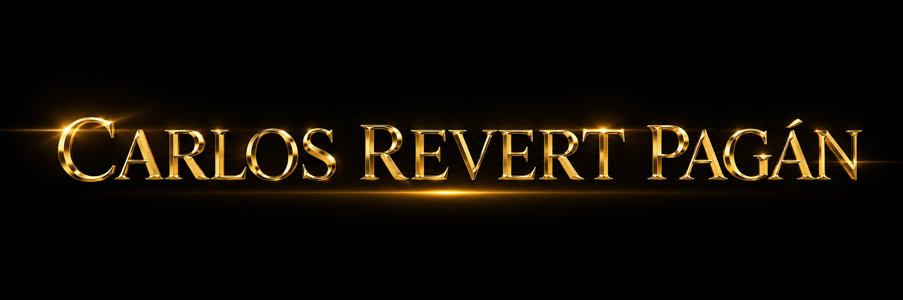

<h3>Full-Stack Developer especializado en IA aplicada, sistemas RAG e infraestructura self-hosted</h3>

Diseño, desarrollo y despliego productos digitales completos, integrando software, inteligencia artificial, automatización e infraestructura.

<!-- Añadir cuando esté disponible:

-->

<a href="#perfil-profesional">Perfil</a> ·
<a href="#proyectos-destacados">Proyectos</a> ·
<a href="#capacidades-técnicas">Capacidades</a> ·
<a href="#stack-tecnológico">Stack</a> ·
<a href="#trayectoria-profesional">Trayectoria</a> ·
<a href="#contacto">Contacto</a>

⸻

Perfil profesional

Soy desarrollador de software Full Stack especializado en la creación de productos que integran inteligencia artificial, sistemas Retrieval-Augmented Generation, automatización de procesos e infraestructura self-hosted.

Trabajo sobre el ciclo completo de desarrollo:

* Análisis del problema y definición de requisitos.
* Diseño de producto y arquitectura.
* Desarrollo de frontend y backend.
* Modelado de datos y persistencia.
* Integración de modelos de lenguaje y servicios externos.
* Construcción de pipelines RAG y procesamiento documental.
* Contenerización, despliegue, monitorización y mantenimiento.

Mi objetivo es convertir capacidades de IA en sistemas útiles, fiables y orientados a negocio, evitando integraciones superficiales y priorizando la calidad del contexto, la trazabilidad de las respuestas y la eficiencia operativa.

Construyo productos digitales completos en los que software, datos, IA e infraestructura funcionan como un único sistema.

⸻

Impacto y resultados

Área	Resultado
RAG jurídico	Más de 12.000 disposiciones, 600.000 artículos y aproximadamente 700.000 vectores indexados.
IA local	Instalación, configuración y optimización de modelos de hasta 120B parámetros.
Producto Full Stack	Desarrollo de aplicaciones completas con frontend, backend, bases de datos, APIs e IA.
Infraestructura	Publicación de aplicaciones sobre infraestructura propia basada en Proxmox, Docker y proxy inverso.
Recuperación semántica	Pipelines de ingestión, limpieza, chunking, embedding, búsqueda vectorial y recuperación documental.
Blockchain y datos	Análisis y reconciliación de datasets con más de 20.000 operaciones procedentes de múltiples redes y plataformas.
Automatización	Integración de agentes, modelos de IA, APIs y flujos automatizados para procesos empresariales.

⸻

Proyectos destacados

⚖️ Juridia — Sistema RAG para normativa española

Sistema de consulta jurídica basado en Retrieval-Augmented Generation, diseñado para localizar normativa española relevante y generar respuestas fundamentadas utilizando el contenido completo de los artículos recuperados.

Escala actual

* Más de 12.000 disposiciones normativas.
* Más de 600.000 artículos almacenados.
* Aproximadamente 700.000 vectores indexados.
* Referencias directas a fuentes oficiales del Boletín Oficial del Estado.

Aspectos técnicos destacados

* PostgreSQL como fuente documental canónica.
* Qdrant como motor de recuperación vectorial.
* Modelo de embedding de 1.024 dimensiones, ajustado para lenguaje jurídico español.
* Normalización, traducción y enriquecimiento semántico de consultas.
* Generación de palabras clave y expansión de la consulta antes de la vectorización.
* Estrategia configurable de recuperación y limitación de candidatos mediante Top-K.
* Chunking adaptado a la estructura y semántica de textos jurídicos.
* Recuperación de artículos completos para conservar el contexto normativo.
* Generación de respuestas respaldadas por documentos recuperados.
* Inclusión de enlaces a las fuentes oficiales utilizadas.
* Detección del idioma de entrada y traducción de consulta y respuesta.
* Persistencia local del historial y mantenimiento de contexto conversacional.
* Frontend diseñado específicamente para navegación y consulta jurídica.

Stack

Python · TypeScript · React · Vite · Tailwind CSS · PostgreSQL · Qdrant · LLM · Embeddings · Docker

<!--
Añadir cuando la captura esté disponible:

-->
<!--
Añadir enlace al repositorio o documentación:

-->

<strong>Ver arquitectura resumida</strong>

flowchart LR
    U[Usuario] --> F[Frontend React]
    F --> API[API Python]
    API --> Q[Normalización y enriquecimiento]
    Q --> E[Embedding jurídico]
    E --> V[Qdrant]
    V -->|IDs y relevancia| P[PostgreSQL]
    P --> C[Construcción del contexto]
    C --> L[Modelo de lenguaje]
    L --> R[Respuesta fundamentada]
    R --> S[Artículos y fuentes oficiales]
    S --> F

⸻

🏗️ CLARK — Catálogo inteligente y generación de presupuestos

Plataforma B2B para la búsqueda, comparación, recomendación y venta asistida de maquinaria de elevación.

El producto está orientado a artículos de alto valor cuya comercialización requiere asesoramiento profesional. En lugar de completar una compra online convencional, el usuario selecciona productos, genera una solicitud de presupuesto y facilita el trabajo posterior del equipo comercial.

Funcionalidades principales

* Catálogo completo de carretillas, elevadores y transpaletas.
* Fichas técnicas detalladas para cada producto.
* Búsqueda y filtrado por características.
* Comparación responsive de dos o tres productos.
* Identificación visual de ventajas por característica.
* Carrito de productos y generación de solicitudes de presupuesto.
* Asistente conversacional con conocimiento sobre productos y empresa.
* Recuperación técnica mediante RAG y búsqueda semántica.
* Navegación contextual desde el asistente hacia productos y comparativas.
* Recomendaciones basadas en las necesidades expresadas por el cliente.
* Diseño adaptado a escritorio, tablet y móvil.

Decisiones de producto

* Flujo orientado a captación comercial en lugar de venta directa.
* Presentación simplificada de especificaciones técnicas complejas.
* Uso del asistente como herramienta de descubrimiento y recomendación.
* Integración de catálogo, comparador, carrito y chatbot dentro de una única experiencia.

Stack

Python · TypeScript · Next.js · React · Tailwind CSS · PostgreSQL · pgvector · LLM local · Docker

<!--
Añadir cuando la captura esté disponible:

-->
<!--
Añadir enlace al repositorio o documentación:

-->

⸻

🎙️ Transcriptor con IA — Audio a informes estructurados

Aplicación web para grabar, subir y procesar audio, transformándolo en transcripciones e informes estructurados mediante modelos de Speech-to-Text y modelos de lenguaje.

La plataforma combina una interfaz React, una API FastAPI, persistencia en PostgreSQL, procesamiento en segundo plano y proveedores de STT y LLM.

Funcionalidades principales

* Grabación de audio directamente desde el navegador.
* Controles de pausa, reanudación, finalización y cancelación.
* Subida protegida de archivos de audio.
* Conversión automática de formatos a WAV.
* Validación de archivos antes de su procesamiento.
* Transcripción de audios de larga duración mediante Whisper.
* Generación de informes según diferentes modos de procesamiento.
* Procesamiento asíncrono mediante cola de trabajo.
* Persistencia de informes por usuario.
* Posibilidad de utilizar almacenamiento local para escenarios con mayor privacidad.
* Descarga temporal de archivos de audio.
* Eliminación automática de audios tras el periodo de retención.
* Ejecución sobre infraestructura propia.

Arquitectura

* Frontend desacoplado para grabación, gestión y consulta.
* API FastAPI para autenticación, operaciones y orquestación.
* PostgreSQL para usuarios, trabajos e informes.
* Cola de procesamiento para tareas de larga duración.
* Whisper para transcripción.
* LLM para estructuración, resumen y transformación del contenido.
* Retención temporal controlada para archivos de audio.

Stack

Python · FastAPI · React · PostgreSQL · Whisper · STT · LLM · Docker

<!--
Añadir cuando la captura esté disponible:

-->
<!--
Añadir enlace al repositorio o documentación:

-->

⸻

Otros proyectos

Proyecto	Descripción	Enlace
Autopublika	Sistema de identificación de productos mediante EAN, enriquecimiento de información, generación asistida de contenido y planificación de publicaciones. Aplicable tanto a productos como a servicios.	Ver aplicación⁠
Portfolio personal	Página principal donde centralizo mi perfil profesional, proyectos desplegados e información de contacto.	Visitar portfolio⁠

<!--
Añadir cuando la captura esté disponible:

-->

<strong>Principios aplicados en mis proyectos</strong>

* Arquitecturas modulares y mantenibles.
* Separación clara entre frontend, backend y persistencia.
* Integración de servicios internos y APIs externas.
* Contenerización mediante Docker.
* Configuración por variables de entorno.
* Uso de modelos locales y proveedores cloud según el caso de uso.
* Persistencia relacional y recuperación vectorial.
* Gestión de dominios, subdominios, certificados TLS y proxy inverso.
* Control de versiones con Git y GitHub.
* Documentación técnica y preparación para revisión.
* Diseño orientado a producto y necesidades reales de negocio.

⸻

Capacidades técnicas

Inteligencia artificial aplicada

* Integración de modelos de lenguaje mediante APIs y servicios locales.
* Diseño de prompts de sistema, flujos de herramientas y respuestas estructuradas.
* Ingeniería de contexto para aplicaciones conversacionales.
* Selección de modelos según calidad, coste, latencia, contexto y recursos.
* Integración con OpenAI, Anthropic, Google, OpenRouter, xAI y ElevenLabs.
* Configuración de modelos locales de hasta 120B parámetros.
* Evaluación de cuantización, consumo de memoria y backend de inferencia.
* Procesamiento de voz mediante STT y TTS.
* Whisper ejecutado en infraestructura propia.
* OCR con modelos de visión, Tesseract y herramientas especializadas.

Sistemas RAG y procesamiento documental

* Diseño de arquitecturas Retrieval-Augmented Generation.
* Ingesta, limpieza y normalización documental.
* Chunking semántico y estructural.
* Generación y almacenamiento de embeddings.
* Qdrant y pgvector como motores de recuperación.
* Estrategias Top-K, filtrado y recuperación híbrida.
* Enriquecimiento y expansión de consultas.
* Construcción dinámica del contexto.
* Recuperación con trazabilidad hacia las fuentes.
* Bases de conocimiento especializadas por empresa o dominio.

Desarrollo de software

* Desarrollo de aplicaciones Full Stack.
* APIs REST y comunicación entre servicios.
* Aplicaciones modulares y desacopladas.
* Interfaces responsive.
* Modelado y persistencia de datos.
* Integración de servicios externos.
* Procesamiento asíncrono y tareas en segundo plano.
* Gestión de configuración mediante variables de entorno.
* Control de versiones y documentación técnica.

Infraestructura y operaciones

* Administración de entornos Linux.
* Despliegues contenerizados con Docker y Docker Compose.
* Virtualización y administración de servicios mediante Proxmox.
* Publicación de aplicaciones sobre infraestructura propia.
* Gestión de dominios y subdominios.
* Certificados TLS y redirección HTTPS.
* Proxy inverso mediante Nginx Proxy Manager.
* Dynamic DNS y acceso remoto seguro.
* Volúmenes persistentes y separación entre aplicación y datos.
* Infraestructura para ejecutar modelos de IA locales.
* Conocimientos teóricos de Kubernetes.

Automatización y agentes

* Flujos de automatización mediante n8n y Make.
* Integración entre aplicaciones, modelos, APIs y servicios.
* Automatización de publicación, comunicación y procesamiento de información.
* Asistentes conectados con bases de conocimiento empresariales.
* Agentes conversacionales para web, voz y mensajería.
* Configuración avanzada de herramientas y flujos en Hermes Agent.

⸻

Stack tecnológico

Tecnologías principales

Área	Tecnologías y herramientas
Lenguajes	Python, TypeScript, JavaScript, HTML5 y CSS3
Backend	FastAPI, Django, Flask y Node.js
Frontend	React, Next.js, Vite y Tailwind CSS
Bases de datos	PostgreSQL, MySQL y SQLite
Bases vectoriales	Qdrant y pgvector
IA y datos	LLMs, embeddings, RAG, Whisper, STT, TTS y OCR
Infraestructura	Docker, Docker Compose, Proxmox, Linux y Nginx Proxy Manager
Automatización	n8n, Make, APIs y agentes
Control de versiones	Git y GitHub
Administración de datos	DBeaver
Desarrollo asistido por IA	OpenAI Codex, GitHub Copilot, Claude Code y Antigravity

⸻

Modelos y proveedores de inteligencia artificial

Proveedores integrados

* OpenAI.
* Anthropic.
* Google.
* OpenRouter.
* xAI.
* ElevenLabs.

Modelos locales

Experiencia instalando, configurando y evaluando modelos pertenecientes a familias como:

* NVIDIA Nemotron.
* Qwen.
* Gemma.
* DeepSeek.
* gpt-oss.

He trabajado con modelos de hasta 120B parámetros, ajustando:

* Cuantización.
* Ventana de contexto.
* Consumo de memoria.
* Hardware disponible.
* Backend de inferencia.
* Velocidad y concurrencia.
* Calidad de respuesta.
* Adecuación al caso de uso.

⸻

Trayectoria profesional

Mi trayectoria tecnológica comenzó en 2018 dentro del ecosistema Blockchain y Web3, donde desarrollé un perfil autodidacta basado en la investigación, la experimentación y la resolución de problemas reales.

Durante esta etapa profundicé en tecnologías descentralizadas, seguridad, activos digitales, contratos inteligentes, sistemas de consenso y operativa entre múltiples redes y plataformas. También ofrecí asesoramiento técnico y formación especializada.

Posteriormente decidí ampliar y formalizar mi perfil mediante un Máster en Desarrollo Web Full Stack, especializándome en la construcción completa de aplicaciones, desde el frontend y el backend hasta las bases de datos y el despliegue.

Actualmente centro mi trabajo en el desarrollo de productos que combinan:

* Aplicaciones web.
* Modelos de lenguaje.
* Sistemas RAG.
* Bases de datos vectoriales.
* Automatización.
* Agentes conversacionales.
* Procesamiento documental.
* Infraestructura propia.

Esta evolución me permite abordar un producto desde tres perspectivas complementarias: tecnología, negocio y operaciones.

⸻

Blockchain y Web3

Experiencia en Blockchain y Web3 desde 2018, inicialmente de forma autodidacta y posteriormente mediante asesoramiento técnico y formación.

Áreas de conocimiento

* Finanzas descentralizadas.
* Exchanges centralizados y descentralizados.
* NFTs.
* Proof of Work y Proof of Stake.
* Minería y validación.
* Billeteras frías y configuraciones multifirma.
* Contratos inteligentes con Solidity.
* Ethereum y otras redes compatibles.
* Seguridad, custodia y operativa de activos digitales.

Análisis y fiscalidad de criptoactivos

Experiencia en el análisis y organización de operativas complejas relacionadas con activos digitales:

* Reconciliación de más de 20.000 operaciones.
* Datos procedentes de más de 10 exchanges.
* Consolidación de movimientos centralizados y descentralizados.
* Interpretación de operaciones entre diferentes plataformas y redes.
* Estudio de la fiscalidad española aplicada a criptoactivos.
* Organización documental para declaraciones fiscales.

⸻

Formación

Máster en Desarrollo Web Full Stack

Conquer Blocks · Formación online
Periodo: 2024–2026 · Dedicación completa

Formación orientada al desarrollo integral de aplicaciones web:

* Frontend.
* Backend.
* Bases de datos.
* Git y GitHub.
* Arquitectura.
* Despliegue.
* Desarrollo de proyectos funcionales.

Formación en curso

* Máster en Inteligencia Artificial.
* Máster en Desarrollo Blockchain.
* Inglés profesional en Conquer Blocks.

Formación continua

Mantengo una formación permanente en:

* Inteligencia artificial.
* Desarrollo de software.
* Arquitectura de aplicaciones.
* Infraestructura.
* Automatización.
* Modelos locales.
* Ingeniería de prompts.
* Ingeniería de contexto.

⸻

Experiencia profesional complementaria

<strong>Ver experiencia anterior y competencias transferibles</strong>

Jefe de cocina

10 años de experiencia

* Dirección y coordinación de equipos.
* Organización de operaciones diarias.
* Distribución de responsabilidades.
* Control de stock y aprovisionamiento.
* Resolución de incidencias bajo presión.
* Supervisión de calidad y cumplimiento de procesos.

Agente de seguros

Seguros Ocaso · 2 años

* Atención y asesoramiento al cliente.
* Gestión comercial presencial.
* Comunicación de productos y coberturas.
* Identificación de necesidades.
* Desarrollo de relaciones de confianza.

Monitor de fitness y artes marciales

* Planificación y dirección de actividades.
* Comunicación y motivación de grupos.
* Adaptación a diferentes perfiles.
* Transmisión de disciplina y constancia.
* Cinturón negro de Taekwondo.

Esta experiencia me ha permitido desarrollar competencias directamente aplicables a proyectos tecnológicos:

* Liderazgo.
* Comunicación.
* Organización.
* Gestión de prioridades.
* Orientación al cliente.
* Resolución de problemas.
* Trabajo bajo presión.
* Responsabilidad operativa.

⸻

Idiomas

Idioma	Nivel
Castellano	Nativo
Valenciano	Nativo
Inglés escrito	Alto
Inglés oral	Intermedio

⸻

Competencias profesionales

* Aprendizaje autónomo y adaptación tecnológica.
* Pensamiento analítico.
* Resolución estructurada de problemas.
* Liderazgo y coordinación de equipos.
* Gestión de proyectos multidisciplinares.
* Capacidad para transformar necesidades de negocio en soluciones técnicas.
* Mentalidad orientada a producto.
* Documentación e investigación.
* Mejora continua.
* Comunicación con perfiles técnicos y no técnicos.
* Visión conjunta de tecnología, negocio y operaciones.

⸻

Contacto

Estoy interesado en proyectos y oportunidades relacionados con:

* Desarrollo Full Stack.
* Inteligencia artificial aplicada.
* Sistemas RAG.
* Automatización.
* Agentes y asistentes conversacionales.
* Infraestructura self-hosted.
* Productos digitales orientados a negocio.

Hablemos

<!-- Añadir cuando esté disponible:

-->

Disponible para oportunidades profesionales, proyectos y colaboraciones.

